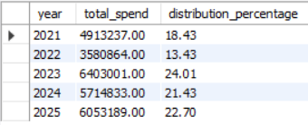
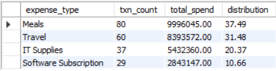
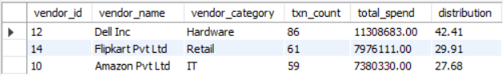
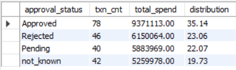
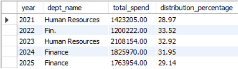

# **Procure-to-Pay (P2P) Data Cleaning & SQL Analytics Project**

## 📌 Project Overview

This project analyzes a **synthetic Procure-to-Pay (P2P) dataset** using **MySQL**, with the core focus on **data quality, data cleaning, and structured SQL-based analytics** rather than dashboards or machine learning.

The central idea of this project is:

> **“Business questions are often simple — but poor data quality makes them hard to answer.”**

Through this work, I demonstrate how messy financial data can distort insights, why data governance matters, and how SQL can be used to systematically clean, validate, and analyze transactional data.

---

## 🏷️ Domain

**Procure-to-Pay (P2P) Financial Data Analytics**

The dataset represents:

* Employee expenses
* Vendor payments
* Departmental spending
* Approval workflows
* Expense categories
* Transaction validation logic

---

## 🛠️ Tools & Techniques

* **Database:** MySQL
* **Core skills demonstrated:**

  * Data cleaning in SQL
  * Views for modular analytics
  * CASE statements
  * Regex validation
  * Aggregations & grouping
  * Multi-table joins
  * Data quality flags

---

## 🔄 Phase 1 — Data Cleaning & Validation

Major data quality issues identified:

* Mixed date formats (`YYYY-MM-DD`, `DD/MM/YYYY`, `DD-MM-YYYY`)
* Invalid dates like `31/02/2024`
* Missing or inconsistent vendor names
* Unstandardized approval statuses
* Outlier transaction amounts
* Employee–department mismatches

**What I did in SQL:**

* Standardized and parsed dates
* Flagged invalid transactions (`is_date_valid`, `is_vendor_valid`, `is_employee_valid`, `is_amount_valid`)
* Created a consolidated `valid_transactions` view
* Normalized approval statuses (`Approved / Rejected / Pending / not_known`)

> **Result:** Only **206 transactions** were fully valid and reliable for analysis.

---

## 📊 Key Analyses 

### 1️⃣ Spend by Year

### 2️⃣ Spend by Category

### 3️⃣ Top Vendors (Valid Spend)

### 4️⃣ Approval Status Breakdown

### 5️⃣ Department Spend per Year

---

## 📈 Business Findings (What the Data Shows)

Even with limited clean data, the analysis revealed clear patterns:

* **Employee-related spend dominates**

  * Meals + Travel together form the majority of valid spend.

* **High vendor concentration risk**

  * Out of three vendors, Dell alone has 42% of total spending.
  * Indicates dependency risk and weak vendor diversification.

* **Weak approval governance**

  * A large share of spend is either *Pending* or *Not Known*.
  * Signals lack of consistent approval tracking in the system.

* **Finance becoming more dominant over time**

  * Early years: HR-heavy spending → likely hiring, training, and employee benefits.
  * Later years: Finance leads spending → likely compliance, systems, or audits.

---

## ✅ Actionable Insights (What the company *should do*)

Based on this analysis, I would recommend:

1. **Strengthen approval workflows**

   * No transaction should exist with `not_known` status.

2. **Reduce vendor dependency**

   * Introduce alternative suppliers to reduce procurement risk.

3. **Audit high-cost categories**

   * Review Meals & Travel policies and reimbursement limits.

4. **Create automated data quality checks**

   * Run SQL validations daily before reporting.

---

## 💰 How Much Money Was Actually Analyzable?

* **Valid transactions:** 206
* **Valid spend analyzed:** ₹26,665,124
* **Percentage of total spend usable:** **15.86%**

> This highlights how **poor data quality can severely limit business decision-making.**

---

